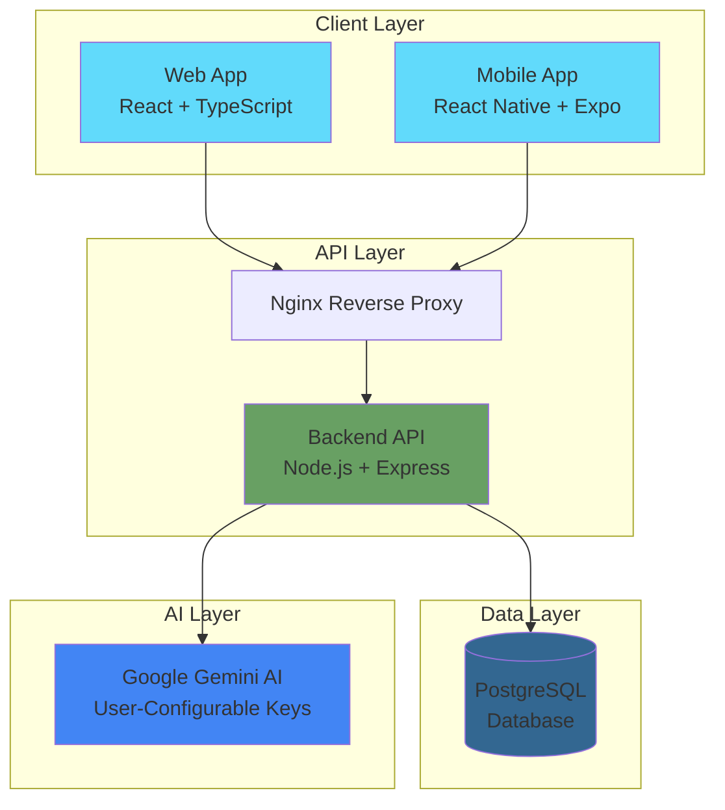
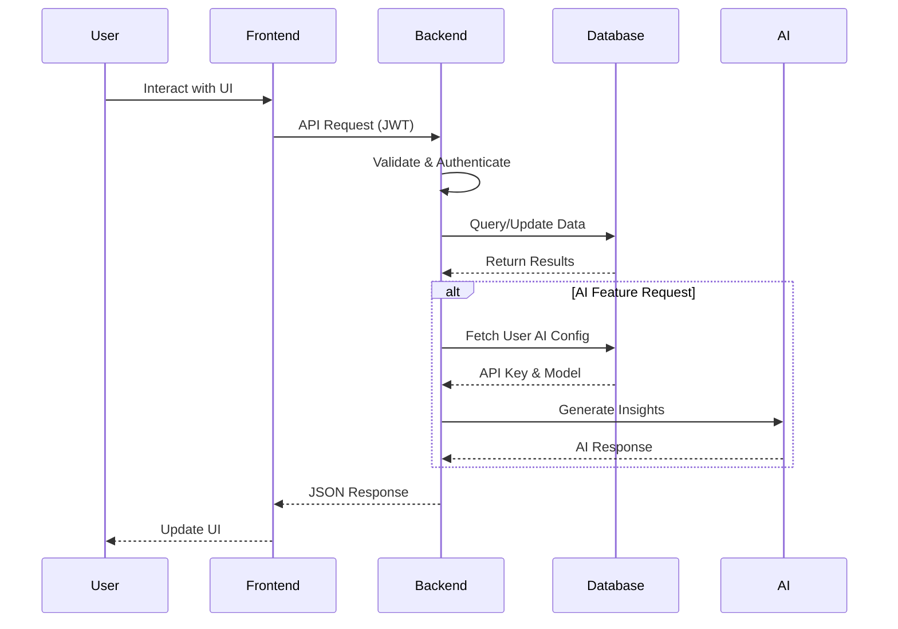

<div align="center">

# 💰 Budget Manager

**A Modern AI-Powered Personal Finance Management Platform**

[](https://www.typescriptlang.org/)
[](https://reactjs.org/)
[](https://nodejs.org/)
[](https://www.postgresql.org/)
[](https://www.docker.com/)
[](https://opensource.org/licenses/MIT)

[Quick Start](#-quick-start) •
[Features](#-key-features) •
[Architecture](#-overall-architecture) •
[Documentation](#-documentation) •
[Contributing](#-contributing)

</div>

---

## 📖 Introduction

**Budget Manager** is a comprehensive, AI-powered personal finance management platform designed to help individuals take control of their financial health. Built with modern web technologies and powered by Google's Gemini AI, it provides intelligent insights, automated budgeting, and personalized financial recommendations.

Whether you're tracking daily expenses, managing debts, setting savings goals, or seeking AI-driven financial advice, Budget Manager offers a seamless experience across web and mobile platforms.

### Why Budget Manager?

- 🎯 **Smart Financial Insights** – AI-powered analysis of your spending patterns and personalized recommendations
- 🔐 **Privacy-First** – User-configurable API keys ensure your data and AI quota remain private
- 📊 **Comprehensive Tracking** – Monitor income, expenses, debts, assets, and budgets in one place
- 🤖 **Conversational AI** – Natural language chatbot for financial queries and automated transaction entry
- 🚀 **Production-Ready** – Containerized architecture with Docker for easy deployment and scaling
- 📱 **Cross-Platform** – Web and mobile (Expo React Native) applications

---

## ✨ Key Features

### 💳 Financial Management

- **Transaction Tracking**: Record and categorize income and expenses with custom tags
- **Budget Planning**: Set budgets by category with support for daily, weekly, monthly, and yearly periods
- **Debt Management**: Track debts, payment schedules, and calculate payoff timelines
- **Asset Management**: Monitor savings, investments, and other assets
- **Goal Setting**: Define financial goals with target amounts and track progress

### 🤖 AI-Powered Intelligence

- **Financial Insights**: Receive AI-generated analysis of spending patterns and trends
- **Smart Chatbot**: Conversational AI assistant for financial questions and guidance
- **Function Calling**: AI automatically creates transactions, debts, and goals through natural conversation
- **Spending Plans**: AI-generated personalized spending recommendations based on your financial data
- **User-Configurable AI**: Each user can configure their own Google AI API key and choose models:
  - `gemini-2.0-flash-exp` (Default) – Fastest, ideal for daily use
  - `gemini-1.5-flash` – Balanced speed and quality
  - `gemini-1.5-pro` – Highest quality, deep analysis

### 📊 Analytics & Reports

- **Financial Dashboard**: Visual overview of income, expenses, and budget performance
- **Spending Trends**: Charts and graphs showing spending patterns over time
- **Budget Performance**: Track actual vs. planned spending by category
- **Custom Reports**: Generate detailed financial reports for any period

### 🔒 Security & Authentication

- **JWT Authentication**: Secure token-based authentication system
- **Password Encryption**: bcrypt hashing for user credentials
- **Role-Based Access**: Admin and user role management
- **Rate Limiting**: Protection against brute force and DDoS attacks
- **Security Headers**: Helmet.js implementation for enhanced security

---

## 🏗️ Overall Architecture

Budget Manager follows a modern, microservices-inspired architecture with clear separation of concerns:



### System Components

| Component | Technology | Purpose |
|-----------|-----------|---------|
| **Frontend** | React 19 + TypeScript | Modern, type-safe user interface |
| **Mobile** | React Native + Expo | Cross-platform mobile application |
| **Backend API** | Node.js + Express | RESTful API server with business logic |
| **Database** | PostgreSQL 15 | Relational data storage with ACID compliance |
| **AI Service** | Google Gemini API | AI-powered insights and chat functionality |
| **Reverse Proxy** | Nginx | Load balancing and SSL termination |
| **Containerization** | Docker + Docker Compose | Consistent deployment across environments |

### Data Flow Architecture



---

## 🚀 Quick Start

### Prerequisites

Before you begin, ensure you have the following installed:

- **Docker & Docker Compose** (recommended) OR
- **Node.js** 16+ and **npm**
- **PostgreSQL** 15+ (if running without Docker)
- **Google AI Studio API Key** ([Get one here](https://aistudio.google.com/app/apikey))

### Option 1: Docker Installation (Recommended)

The fastest way to get started is using Docker:

```bash
# 1. Clone the repository
git clone https://github.com/TranRoger/BUDGET-MANAGER.git
cd BUDGET-MANAGER

# 2. Configure environment variables
cd backend
cp .env.example .env

# 3. Edit .env and add your Google AI API key
nano .env  # or use your preferred editor
# Add: GOOGLE_AI_API_KEY=your-api-key-here

# 4. Return to project root and start services
cd ..
./start.sh
```

The startup script will:
- Build and start all Docker containers
- Initialize the PostgreSQL database with schema and seed data
- Start the backend API on port 5000
- Start the frontend on port 3000
- Configure Nginx reverse proxy on port 80

### Option 2: Manual Installation

For development or when Docker is not available:

```bash
# 1. Clone the repository
git clone https://github.com/TranRoger/BUDGET-MANAGER.git
cd BUDGET-MANAGER

# 2. Install and setup PostgreSQL
createdb budget_manager
psql budget_manager < database/schema.sql
psql budget_manager < database/seed.sql
psql budget_manager < database/add-ai-settings.sql

# 3. Configure and start backend
cd backend
npm install
cp .env.example .env
# Edit .env with your database credentials and Google AI API key
npm run dev

# 4. In a new terminal, configure and start frontend
cd frontend
npm install
npm start
```

### Access the Application

Once running, access the application at:

- **Web Application**: http://localhost:3000
- **Backend API**: http://localhost:5000/api
- **API Documentation**: http://localhost:5000/api/docs
- **PostgreSQL**: localhost:5432

### Default Credentials

For testing purposes, use these default credentials:

```
Email: admin@budgetmanager.com
Password: Admin@123
```

> ⚠️ **Important**: Change the default admin password immediately in production environments!

---

## ⚙️ Environment Configuration

### Backend Environment Variables

Create a `.env` file in the `backend/` directory:

```bash
# Server Configuration
NODE_ENV=development
PORT=5000

# Database Configuration
DB_HOST=localhost
DB_PORT=5432
DB_NAME=budget_manager
DB_USER=postgres
DB_PASSWORD=postgres123

# JWT Configuration
JWT_SECRET=your_super_secret_jwt_key_change_in_production
JWT_EXPIRES_IN=7d

# Google AI Configuration (Optional - users can configure their own)
GOOGLE_AI_API_KEY=your_google_ai_api_key_here

# CORS Configuration
CORS_ORIGIN=http://localhost:3000

# Rate Limiting
RATE_LIMIT_WINDOW_MS=900000
RATE_LIMIT_MAX_REQUESTS=100
```

### Frontend Environment Variables

Create a `.env` file in the `frontend/` directory:

```bash
# API Configuration
REACT_APP_API_URL=http://localhost:5000/api

# Feature Flags
REACT_APP_ENABLE_AI_FEATURES=true
REACT_APP_ENABLE_MOBILE_FEATURES=false
```

### Docker Environment Variables

The `docker-compose.yml` file uses environment variables. Create a `.env` file in the project root:

```bash
# Google AI API Key
GOOGLE_AI_API_KEY=your_google_ai_api_key_here

# Database Credentials
POSTGRES_PASSWORD=postgres123
```

---

## 📁 Folder Structure

```
BUDGET-MANAGER/
│
├── 📄 README.md                    # You are here
├── 📄 docker-compose.yml           # Docker orchestration
├── 📄 start.sh                     # Quick start script
│
├── 📂 backend/                     # Node.js API Server
│   ├── 📄 server.js                # Application entry point
│   ├── 📄 package.json             # Dependencies
│   ├── 📂 config/                  # Configuration files
│   │   ├── database.js             # Database connection
│   │   └── security.js             # Security settings
│   ├── 📂 middleware/              # Express middleware
│   │   ├── auth.js                 # JWT authentication
│   │   ├── errorHandler.js         # Global error handling
│   │   ├── rateLimiter.js          # Rate limiting
│   │   └── validation.js           # Input validation
│   ├── 📂 routes/                  # API endpoints
│   │   ├── auth.js                 # Authentication routes
│   │   ├── transactions.js         # Transaction management
│   │   ├── budgets.js              # Budget management
│   │   ├── categories.js           # Category management
│   │   ├── debts.js                # Debt tracking
│   │   ├── goals.js                # Goal management
│   │   ├── reports.js              # Analytics & reports
│   │   ├── spendingLimits.js       # Spending limits
│   │   └── ai.js                   # AI features
│   ├── 📂 services/                # Business logic
│   │   └── aiService.js            # AI integration service
│   └── 📂 utils/                   # Utility functions
│       ├── asyncHandler.js         # Async error handling
│       ├── errors.js               # Custom error classes
│       └── logger.js               # Winston logger
│
├── 📂 frontend/                    # React Web Application
│   ├── 📄 package.json             # Dependencies
│   ├── 📂 public/                  # Static assets
│   │   ├── index.html              # HTML template
│   │   └── manifest.json           # PWA manifest
│   └── 📂 src/
│       ├── 📄 App.tsx              # Root component
│       ├── 📄 index.tsx            # Application entry
│       ├── 📂 components/          # Reusable UI components
│       │   ├── Navbar.tsx          # Navigation bar
│       │   ├── Card.tsx            # Card component
│       │   ├── ChatBubble.tsx      # Chat UI component
│       │   ├── TransactionList.tsx # Transaction display
│       │   └── ProtectedRoute.tsx  # Route guard
│       ├── 📂 pages/               # Page components
│       │   ├── Dashboard.tsx       # Main dashboard
│       │   ├── Transactions.tsx    # Transaction management
│       │   ├── Budgets.tsx         # Budget planning
│       │   ├── Reports.tsx         # Analytics
│       │   ├── AIChat.tsx          # AI chatbot
│       │   └── Settings.tsx        # User settings
│       ├── 📂 services/            # API client services
│       │   ├── authService.ts      # Authentication
│       │   ├── transactionService.ts
│       │   ├── budgetService.ts
│       │   └── aiService.ts
│       ├── 📂 context/             # React Context
│       │   └── AuthContext.tsx     # Auth state management
│       ├── 📂 hooks/               # Custom React hooks
│       └── 📂 utils/               # Utility functions
│
├── 📂 mobile/                      # React Native Mobile App
│   ├── 📄 App.tsx                  # Mobile app entry
│   ├── 📄 app.json                 # Expo configuration
│   └── 📂 src/
│       ├── 📂 screens/             # Mobile screens
│       ├── 📂 components/          # Mobile components
│       └── 📂 services/            # API services
│
├── 📂 database/                    # Database schemas & migrations
│   ├── 📄 schema.sql               # Complete database schema
│   ├── 📄 seed.sql                 # Sample data
│   ├── 📄 add-ai-settings.sql      # AI configuration migration
│   ├── 📄 add-roles.sql            # User roles migration
│   ├── 📄 spending-plans-schema.sql # Spending plans
│   └── 📄 debt-transactions-schema.sql # Debt transactions
│
├── 📂 nginx/                       # Nginx configuration
│   └── 📄 nginx.conf               # Reverse proxy config
│
└── 📂 docs/                        # Documentation
    ├── 📄 API.md                   # API documentation
    ├── 📄 SETUP.md                 # Detailed setup guide
    ├── 📄 CONTRIBUTING.md          # Contribution guidelines
    ├── 📄 AI-SETTINGS-GUIDE.md     # AI configuration guide
    └── 📄 ARCHITECTURE-DIAGRAM.md  # System architecture
```

---

## 🏃 Running the Project

### Development Mode

**Backend:**
```bash
cd backend
npm run dev  # Runs with nodemon for auto-reload
```

**Frontend:**
```bash
cd frontend
npm start    # Starts development server on port 3000
```

**Mobile:**
```bash
cd mobile
npm start    # Starts Expo development server
# Then press 'i' for iOS simulator or 'a' for Android emulator
```

### Production Mode

**Using Docker Compose:**
```bash
docker-compose up -d --build
```

**Manual Production Build:**
```bash
# Build frontend
cd frontend
npm run build

# Serve with static file server or nginx
npx serve -s build -l 3000

# Start backend in production mode
cd ../backend
NODE_ENV=production npm start
```

### Database Management

**Reset Database:**
```bash
./cleanup-inodes.sh  # Clean up old data
docker-compose down -v
docker-compose up -d
```

**Run Migrations:**
```bash
psql -h localhost -U postgres -d budget_manager -f database/add-ai-settings.sql
```

**Backup Database:**
```bash
pg_dump -h localhost -U postgres budget_manager > backup_$(date +%Y%m%d).sql
```

---

## 📚 Documentation

Comprehensive documentation is available in the `docs/` folder:

- **[API Documentation](API.md)** – Complete REST API reference with examples
- **[Setup Guide](SETUP.md)** – Detailed installation and configuration instructions
- **[Architecture Diagram](ARCHITECTURE-DIAGRAM.md)** – System design and data flow
- **[AI Settings Guide](AI-SETTINGS-GUIDE.md)** – Configure user-specific AI settings
- **[Contributing Guidelines](CONTRIBUTING.md)** – How to contribute to the project
- **[Quick Start Guide](QUICKSTART.md)** – Get started in 5 minutes
- **[Admin Guide](QUICKSTART-ADMIN.md)** – Admin features and management
- **[Mobile Quick Start](MOBILE-QUICKSTART.md)** – Mobile app setup

---

## 🤝 Contributing

We welcome contributions from the community! Budget Manager is open-source and thrives on collaboration.

### How to Contribute

1. **Fork the Repository**
   ```bash
   git fork https://github.com/TranRoger/BUDGET-MANAGER
   ```

2. **Create a Feature Branch**
   ```bash
   git checkout -b feature/amazing-feature
   ```

3. **Make Your Changes**
   - Write clean, readable code
   - Follow existing code style and conventions
   - Add tests for new features
   - Update documentation as needed

4. **Commit Your Changes**
   ```bash
   git commit -m "feat: add amazing feature"
   ```
   
   We follow [Conventional Commits](https://www.conventionalcommits.org/):
   - `feat:` – New feature
   - `fix:` – Bug fix
   - `docs:` – Documentation changes
   - `style:` – Code style changes (formatting)
   - `refactor:` – Code refactoring
   - `test:` – Adding tests
   - `chore:` – Maintenance tasks

5. **Push and Create Pull Request**
   ```bash
   git push origin feature/amazing-feature
   ```
   Then open a Pull Request on GitHub

### Development Guidelines

- **Code Style**: We use ESLint and Prettier for consistent code formatting
- **Testing**: Write unit tests for new features using Jest
- **Documentation**: Update README and relevant docs for user-facing changes
- **Commits**: Use meaningful commit messages with conventional commit format
- **Pull Requests**: Provide clear descriptions and link related issues

### Areas for Contribution

- 🐛 Bug fixes and issue resolution
- ✨ New features and enhancements
- 📝 Documentation improvements
- 🌍 Internationalization and translations
- 🎨 UI/UX improvements
- ⚡ Performance optimizations
- 🧪 Test coverage improvements

See [CONTRIBUTING.md](CONTRIBUTING.md) for detailed guidelines.

---

## 📄 License

This project is licensed under the **MIT License** – see the [LICENSE](LICENSE) file for details.

```
MIT License

Copyright (c) 2026 Budget Manager Contributors

Permission is hereby granted, free of charge, to any person obtaining a copy
of this software and associated documentation files (the "Software"), to deal
in the Software without restriction, including without limitation the rights
to use, copy, modify, merge, publish, distribute, sublicense, and/or sell
copies of the Software, and to permit persons to whom the Software is
furnished to do so, subject to the following conditions:

The above copyright notice and this permission notice shall be included in all
copies or substantial portions of the Software.

THE SOFTWARE IS PROVIDED "AS IS", WITHOUT WARRANTY OF ANY KIND, EXPRESS OR
IMPLIED, INCLUDING BUT NOT LIMITED TO THE WARRANTIES OF MERCHANTABILITY,
FITNESS FOR A PARTICULAR PURPOSE AND NONINFRINGEMENT.
```

---

## 🗺️ Roadmap

### Version 1.0 (Current) ✅

- [x] Core financial tracking (transactions, budgets, debts, goals)
- [x] User authentication and authorization
- [x] AI-powered insights and chatbot
- [x] User-configurable AI settings
- [x] Web application (React + TypeScript)
- [x] Mobile application (React Native + Expo)
- [x] Docker containerization
- [x] PostgreSQL database with comprehensive schema

### Version 1.5 (Q2 2026) 🚧

- [ ] **Bank Integration** – Connect to bank accounts for automatic transaction import
- [ ] **Receipt Scanning** – OCR-powered receipt capture and categorization
- [ ] **Recurring Transactions** – Automated handling of recurring income/expenses
- [ ] **Multi-Currency Support** – Track finances in multiple currencies with exchange rates
- [ ] **Data Export** – Export financial data to CSV, Excel, and PDF
- [ ] **Advanced Analytics** – Machine learning-based spending predictions

### Version 2.0 (Q4 2026) 🔮

- [ ] **Investment Tracking** – Monitor stocks, bonds, and cryptocurrency portfolios
- [ ] **Bill Reminders** – Smart notifications for upcoming bills and payments
- [ ] **Collaborative Budgets** – Share budgets with family members or partners
- [ ] **Tax Preparation** – Generate tax reports and categorize deductible expenses
- [ ] **API for Third-Party Integration** – Public API for developers
- [ ] **White-Label Solution** – Customizable branding for enterprise deployments

### Long-Term Vision 🌟

- **AI Financial Advisor** – Advanced AI model trained on financial best practices
- **Blockchain Integration** – Decentralized finance (DeFi) tracking
- **Global Marketplace** – Connect with financial service providers
- **Credit Score Monitoring** – Track and improve credit scores
- **Insurance Management** – Monitor policies and optimize coverage

---

## 🙏 Acknowledgments

Budget Manager is built with amazing open-source technologies:

- **[React](https://reactjs.org/)** – UI framework
- **[Node.js](https://nodejs.org/)** – Backend runtime
- **[PostgreSQL](https://www.postgresql.org/)** – Reliable database
- **[Google Gemini AI](https://ai.google.dev/)** – AI capabilities
- **[Expo](https://expo.dev/)** – Mobile development platform
- **[Docker](https://www.docker.com/)** – Containerization
- **[TypeScript](https://www.typescriptlang.org/)** – Type safety
- **[Express.js](https://expressjs.com/)** – Web framework

---

## 📞 Support & Community

- **Issues**: [GitHub Issues](https://github.com/TranRoger/BUDGET-MANAGER/issues)
- **Discussions**: [GitHub Discussions](https://github.com/TranRoger/BUDGET-MANAGER/discussions)
- **Email**: support@budgetmanager.com

---

<div align="center">

**Made with ❤️ by the Budget Manager Team**

⭐ Star us on GitHub — it helps!

[Report Bug](https://github.com/TranRoger/BUDGET-MANAGER/issues) •
[Request Feature](https://github.com/TranRoger/BUDGET-MANAGER/issues) •
[Documentation](https://github.com/TranRoger/BUDGET-MANAGER/wiki)

</div>

- [Setup Guide](SETUP.md) - Detailed setup instructions
- [API Reference](API.md) - Complete API documentation
- [Contributing](CONTRIBUTING.md) - Contribution guidelines
- [Backend README](backend/README.md) - Backend documentation
- [Frontend README](frontend/README.md) - Frontend documentation

## Project Structure

```
BUDGET-MANAGER/
├── backend/              # Node.js/Express API
│   ├── config/          # Database configuration
│   ├── middleware/      # Authentication middleware
│   ├── routes/          # API routes
│   ├── services/        # Business logic & AI service
│   └── server.js        # Entry point
├── frontend/            # React TypeScript app
│   ├── public/          # Static assets
│   └── src/
│       ├── components/  # React components
│       ├── services/    # API services
│       └── App.tsx      # Main app component
├── database/            # Database schemas
│   ├── schema.sql       # Database schema
│   └── seed.sql         # Sample data
├── credentials/         # Google Cloud credentials (git-ignored)
├── docker-compose.yml   # Docker configuration
├── start.sh            # Quick start script
└── setup-manual.sh     # Manual setup script
```

## Technologies Used

### Backend
- Node.js & Express.js
- PostgreSQL
- JWT Authentication
- Google Cloud Vertex AI (Gemini Pro)

### Frontend
- React 19 with TypeScript
- Axios for API calls
- React Router for navigation

### DevOps
- Docker & Docker Compose
- PostgreSQL Container

## Environment Variables

### Backend (.env)
```env
DB_HOST=localhost
DB_PORT=5432
DB_NAME=budget_manager
DB_USER=postgres
DB_PASSWORD=your_password
PORT=5000
JWT_SECRET=your_jwt_secret
GOOGLE_CLOUD_PROJECT_ID=your_project_id
GOOGLE_APPLICATION_CREDENTIALS=./path/to/service-account-key.json
VERTEX_AI_LOCATION=us-central1
```

### Frontend (.env)
```env
REACT_APP_API_URL=http://localhost:5000/api
```

## Contributing

Contributions are welcome! Please read [CONTRIBUTING.md](CONTRIBUTING.md) for details on our code of conduct and the process for submitting pull requests.

## License

This project is licensed under the ISC License.

## Support

For issues and questions, please create an issue in the repository.

---

## 🎉 Frontend Status: HOÀN THÀNH

### ✅ Frontend đã được triển khai đầy đủ với:

- **27 TypeScript files** - Components, Pages, Services, Hooks
- **12 CSS files** - Professional styling
- **6 complete pages** - Login, Register, Dashboard, Transactions, Budgets, Reports, AI Chat
- **7 API services** - Full integration với backend
- **Responsive design** - Mobile & Desktop
- **Modern UI/UX** - Gradient design, animations, color-coding

### 🚀 Quick Test Frontend

```bash
# Test frontend ngay
./test-frontend.sh

# Hoặc manual
cd frontend
npm install
npm start
```

### 📚 Documentation

- [FRONTEND-SUMMARY.md](FRONTEND-SUMMARY.md) - Tổng quan frontend
- [FRONTEND-COMPLETE.md](FRONTEND-COMPLETE.md) - Chi tiết implementation
- [frontend/FRONTEND-README.md](frontend/FRONTEND-README.md) - Hướng dẫn frontend

---

Made with ❤️ for better financial management